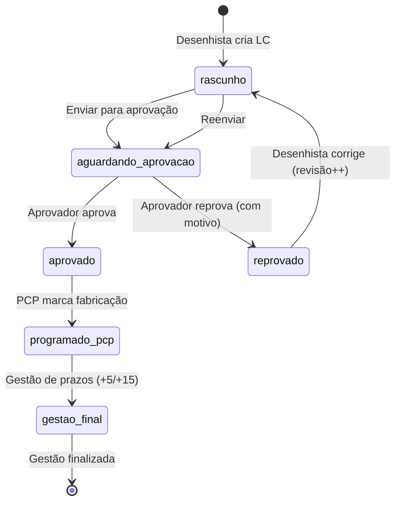

# Fluxo de trabalho — Ciclo de vida de uma LC

## Diagrama do fluxo

## Etapas detalhadas

### 1. Cadastro (Desenhista)
- Cria LC com OS, cliente, equipamento, datas e setor.
- Status inicial: **rascunho**.
- Pode editar ou excluir enquanto não enviada para aprovação.

### 2. Envio para aprovação (Desenhista)
- Valida dados obrigatórios.
- Status passa para **aguardando_aprovacao**.
- Registra data/hora de envio e evento no histórico.

### 3. Análise técnica (Aprovador)
- Consulta fila em `/aprovacao`.
- **Aprovar:** status **aprovado**; registra aprovador e timestamp.
- **Reprovar:** status **reprovado**; exige motivo; desenhista é notificado.

### 4. Correção (Desenhista)
- Edita LC reprovada.
- Número de **revisão** incrementa.
- Retorna ao fluxo de envio para aprovação.

### 5. Programação PCP
- PCP acessa desenhos **aprovados** ainda não programados.
- Marca **programado para fabricação** com responsável e data.

### 6. Gestão LC final
- Controle de prazos contratuais (+5 e +15 dias).
- Finalização da gestão por OS quando concluída.
- Visão geral em `/gestao-lc-final-geral`.

### 7. Acompanhamento gerencial
- Dashboard em `/gerencia` com indicadores consolidados.
- Usuários tipo **B** (visualizador) têm acesso de leitura ao painel.

## Histórico (auditoria)

Cada transição relevante gera registro em `controle_lc_historico`:

| Ação | Descrição |
| ---- | --------- |
| `criado` | LC cadastrada |
| `editado` | Alteração em rascunho ou correção |
| `enviado_aprovacao` | Enviada para fila do aprovador |
| `aprovado` | Aprovação técnica concedida |
| `reprovado` | Reprovação com motivo |
| `programacao_pcp` | Marcada para fabricação |

A UI exibe a linha do tempo na tela de detalhe da LC (`LCHistoryTimeline`).

## Status de aprovação

| Status | Significado |
| ------ | ----------- |
| `rascunho` | Em elaboração pelo desenhista |
| `aguardando_aprovacao` | Na fila do aprovador |
| `aprovado` | Liberada para PCP |
| `reprovado` | Pendente de correção |
